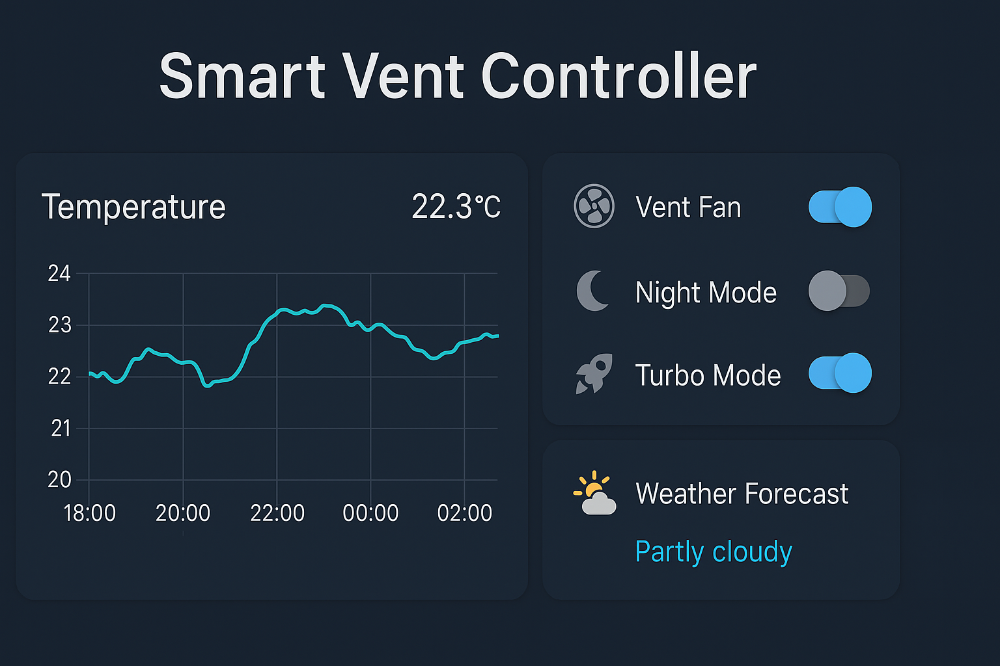

<p align="center">
  <br>
  <b>Smart Vent Controller for ESPHome</b><br>
  Intelligent ventilation control system for your home.
</p>

---

# 🌬️ Smart Vent Controller (ESPHome) / Контроллер Вентиляции ESPHome

[](https://esphome.io)
[](https://www.espressif.com/)
[](LICENSE)
[](https://github.com/Satimaro/Smart-Vent-Controller-ESPHome/stargazers)
[](https://www.home-assistant.io/)
[](#)

---

## 🇬🇧 English

### 🧭 Overview
**Smart Vent Controller** is an intelligent ventilation control system based on **ESPHome** and **ESP32**.  
It combines data from temperature, humidity, and pressure sensors, analyzes weather trends, and provides intelligent fan modes: *Night* and *Turbo*.

### ⚙️ Features
- **ESP32 + ESPHome (IDF framework)**
- Works with **DHT11** and **BMP180** sensors
- Calculates average temperature, sea-level pressure, and 1-hour pressure trend
- Text-based weather forecast (☀️ 🌤️ ☁️ 🌧️ ⛈️)
- Smart fan control with **PWM (25 kHz)**
- Night Mode (speed limit) and Turbo Mode (100%)
- State restoration after reboot
- Full integration with **Home Assistant**

### 🧩 Entities in Home Assistant

| Type | Name | Description |
|------|------|-------------|
| 🌡️ Sensor | `Temperature`, `Room Humidity` | Temperature and humidity |
| ⛅ Sensor | `Atmospheric Pressure`, `Sea Level Pressure`, `Pressure Trend 1h` | Pressure and trend |
| 🌀 Fan | `Vent Fan` | Controlled ventilation fan |
| 💡 Switch | `Night Mode`, `Turbo Mode` | Mode control |
| ⚙️ Number | `Night Mode Max Speed` | Night speed limit |
| 🧠 Text | `Fan Status`, `Weather Forecast`, `ESPHome Version` | Informational states |

### 🧾 Installation
1. Copy `smart_vent_controller.yaml` to your ESPHome folder  
2. Add your Wi-Fi credentials to `secrets.yaml`:
   ```yaml
   wifi_ssid: "MyWiFi"
   wifi_password: "password123"
   ```
3. Compile and flash via **ESPHome Dashboard**  
4. The device will automatically appear in **Home Assistant**

### 🧠 Author
**Dima (Satimaro)** — [@Satimaro](https://github.com/Satimaro)

### 🪪 License
Released under the **MIT License** — free to use, modify, and distribute.

> 💡 *“Smart control. Fresh air. Maximum comfort.”* — Satimaro

---

## 🇷🇺 Русская версия

### 🧭 Описание
**Smart Vent Controller** — умная система управления вентиляцией на базе **ESPHome** и **ESP32**.  
Она объединяет данные с датчиков температуры, влажности и давления, анализирует тренды погоды и реализует интеллектуальные режимы вентилятора: *ночной* и *турбо*.

### ⚙️ Возможности
- **ESP32 + ESPHome (IDF)**
- Поддержка сенсоров **DHT11** и **BMP180**
- Расчёт средней температуры, давления на уровне моря и тренда за 1 час
- Текстовый прогноз погоды (☀️ 🌤️ ☁️ 🌧️ ⛈️)
- Управление вентилятором через **PWM (25 кГц)**
- Режимы: ночной (ограничение скорости) и турбо (100%)
- Восстановление состояния после перезапуска
- Полная интеграция с **Home Assistant**

### 🧩 Сущности в Home Assistant

| Тип | Имя | Описание |
|------|------|-----------|
| 🌡️ Сенсор | `Temperature`, `Room Humidity` | Температура и влажность |
| ⛅ Сенсор | `Atmospheric Pressure`, `Sea Level Pressure`, `Pressure Trend 1h` | Давление и тренд |
| 🌀 Вентилятор | `Vent Fan` | Управляемый вентилятор |
| 💡 Переключатели | `Night Mode`, `Turbo Mode` | Режимы работы |
| ⚙️ Слайдер | `Night Mode Max Speed` | Максимальная скорость в ночном режиме |
| 🧠 Текстовые сенсоры | `Fan Status`, `Weather Forecast`, `ESPHome Version` | Информационные данные |

### 🧾 Установка
1. Скопируйте файл `smart_vent_controller.yaml` в папку `esphome/`  
2. Укажите параметры Wi-Fi в `secrets.yaml`  
3. Скомпилируйте и прошейте через **ESPHome Dashboard**  
4. Устройство автоматически появится в **Home Assistant**

### 🧠 Автор
**Dima (Satimaro)** — [@Satimaro](https://github.com/Satimaro)

### 🪪 Лицензия
Проект распространяется под лицензией **MIT** — свободно используйте, изменяйте и улучшайте.

> 💡 *«Простое управление. Умная вентиляция. Максимальный комфорт.»* — Satimaro
